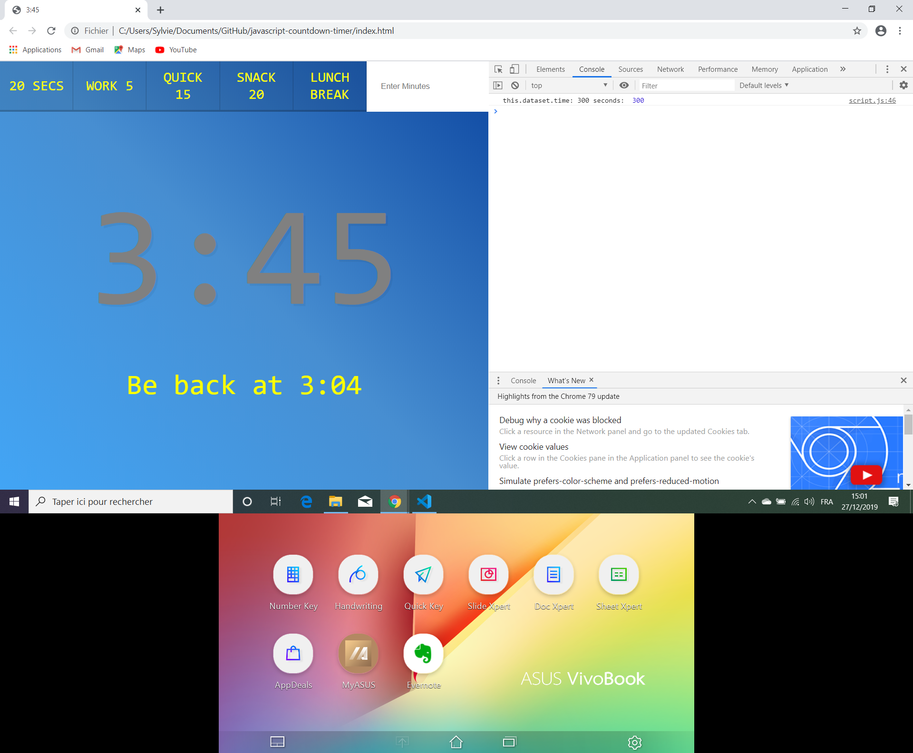

# :zap: Javascript30 Tutorial Countdown Timer

* Wes Bos Youtube Tutorial 29/30: [Vanilla JS Countdown Timer - #JavaScript30 29/30](https://www.youtube.com/watch?v=LAaf7-WuJJQ).

*** Note: to open web links in a new window use: _ctrl+click on link_**

## :page_facing_up: Table of contents

* [General info](#general-info)
* [Screenshots](#screenshots)
* [Technologies](#technologies)
* [Setup](#setup)
* [Features](#features)
* [Status](#status)
* [Inspiration](#inspiration)
* [Contact](#contact)

## :books: General info

* Uses javascript to display a countdown with inputs from html form input or from buttons with fixed times.

## :camera: Screenshots

.

## :signal_strength: Technologies

* [Javascript v1.9 ECMA-262 ECMAScript 2018](http://www.ecma-international.org/publications/standards/Ecma-262.htm)

## :floppy_disk: Setup

* Open index.html in browser. If any code is changed the browser needs to be refreshed.

## :computer: Code Examples

* Code to display time left. 

```javascript
function displayTimeLeft(seconds) {
  const minutes = Math.floor(seconds / 60); // floor removes remainder
  const remainderSeconds = seconds % 60; // modulus division remainder
  const display = `${minutes}:${remainderSeconds < 10? '0' : '' }${remainderSeconds}`;
  document.title = display;
  timerDisplay.textContent = display;
}
```

## :cool: Features

* A range of times can be selected or a custom time can be created.

## :clipboard: Status & To-Do List

* Status: Working. Updated to work from browser, not from Glitch.
* To-Do: nothing

## :clap: Inspiration

* Wes Bos Youtube Tutorial 29/30: [Vanilla JS Countdown Timer - #JavaScript30 29/30](https://www.youtube.com/watch?v=LAaf7-WuJJQ)

## :envelope: Contact

* Repo created by [ABateman](https://www.andrewbateman.org) - you are welcome to [send me a message](https://andrewbateman.org/contact)
